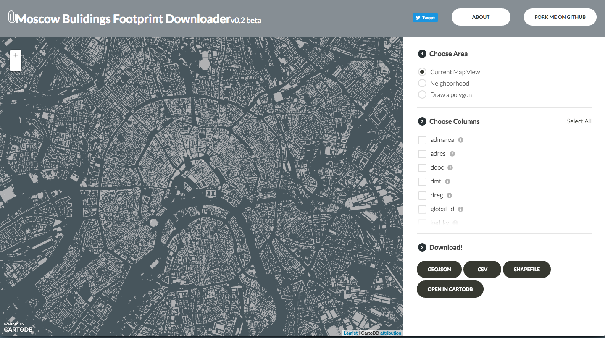

# moscowplus

A custom download tool for Moscow builsings footprint tax lot data, built with CartoDB as fork of Crhis Whong's [Plutoplus]((http://chriswhong.github.io/plutoplus)).  View it live at [http://casyfill.github.io/mosplus/#]

About
=====

Building Footprint is a great Moscow Open Data Resource that contains a wealth of information about the city's building footprints, including adress, cadaster zoning, status, registration data, and few more attributes.It contains information for the city's 145,000+ buildings, and includes 19 attributes for each one. That is (so far) a unique open data collection for Russia!

- [Brief Description(rus)](http://data.mos.ru/opendata/1927/description?versionNumber=1&releaseNumber=1)
- [Dataset Passport](http://data.mos.ru/opendata/1927/passport?versionNumber=1&releaseNumber=1)
- [Dataset](http://data.mos.ru/opendata/1927/data/table?versionNumber=1&releaseNumber=1)

Moscow Building Footprint is quite large, awailable through an [API](http://api.data.mos.ru/) only and hard to use. That is why I used blueprints for a [great tool](http://chriswhong.github.io/plutoplus/#) from Chris Wong (originally for **MapPluto** dataset) to to help people get access to smaller chunks of the data quickly and easily for whatever they are working on.
All data is version from *25.03.2016* and can be exported as *geoJSON*, *zipped shapefile*, and *CSV*, or can be *imported directly to your cartoDB account*. Geometries are exported in WGS84 (Latitude and Longitude). For neighborhood (rayon) borders, [this dataset](http://gis-lab.info/qa/moscow-atd.html) from Gis-Lab was used.

If you like this project, let me know by tweeting to @casy_fill. You can easily fork the original code (thanks to Chris, again). This project was built with the CartoDB web mapping platform. [Here]((http://chriswhong.com/open-data/building-a-custom-downloader-for-nycs-pluto-data/))Chris describes his original pipeline. I will try to add my experience as well. Support open Data!

Getting the data
================

to get all data at once: download this repository and make use of Makefile:
	cd data_processing; make data

Process requires python 2.7 and basic libraries:
	- pandas
	- geopandas
	- requests

TODO
====

- [x] initial
- [x] fields properties
- [x] join db, drop geoData 
- [x] data_export 
- [x] neighborhoods
	- [x] add neighborhoods to the map
	- [x] create spatial joint and id
	- [x] connect to the frontend
- [x] description
- [x] map style
- [x] map center
- [x] buttons style
- [x] favicon
- [x] csv
- [x] brushing
- [ ] migrate Database